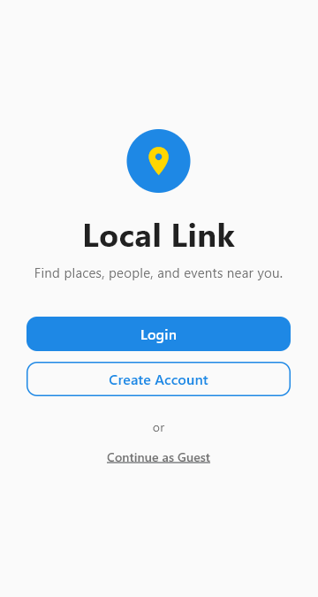

# Gathering

A map-based social discovery app built with Flutter and Firebase. Drop pins and discover new places, friends, and experiences.

Github : [Link]([url](https://github.com/Konner-Yi/Adv-Mobile-Final-Project))

## Features

### Interactive Map
- Full-screen map powered by **flutter_map** with MapTiler tiles
- Real-time GPS tracking with animated pulse dot and compass heading
- Two marker types: user-created **posts** and **nearby places** (from OpenStreetMap)
- Tap-to-place mode for creating new geo-tagged posts

### Discovery Feed
- Browse nearby places with category filters: Food, Coffee, Shopping, Health, Parks, Education, Transit
- Search for both **places** (via Overpass API) and **users** (via Firestore)
- Embedded map preview widget

### Posts & Content Creation
- Create geo-tagged posts pinned to map coordinates with a photo and caption
- **Free map posts** and **place posts** (tied to a specific OSM location, proximity-gated within 150m)
- Engagement: likes, dislikes (with reason), star ratings, reposts, saves, comments
- Reputation scoring: posting earns +5, receiving likes earns +2

### Community Moderation
- Dislike system with categorized reasons (Inappropriate, Spam, Low Quality, Other)
- Auto-removal of posts exceeding 5 dislikes
- User blocking with a dedicated management screen

### Places & Directions
- Nearby POIs fetched from the **Overpass API** (OpenStreetMap)
- Place details: name, type, address, phone, website, opening hours
- Pin places to your profile for quick access
- Turn-by-turn directions via **OSRM** with live GPS tracking and route polylines

### Real-Time Messaging
- 1-on-1 chat powered by Cloud Firestore
- Conversation list with last message preview, timestamps, and unread counts
- User search by username to start new conversations

### Friends System
- Send, accept, decline, and cancel friend requests
- Filter/sort friends: A-Z, Z-A, Recent, Nearby
- All operations use Firestore transactions for atomicity

### User Profiles
- Three-tab layout: Posts, Pins, Saved
- Reputation levels: Newcomer → Explorer → Local Guide → Community Leader
- Profile fields: username, name, pronouns, bio, country, interest tags, profile photo
- 30 selectable interest tags across 4 categories

### Authentication
- Firebase Auth with email/password registration and login
- Auto-login for returning users
- Password reset via email

## Project Structure

```
lib/
├── main.dart              # Entry point
├── app.dart               # MaterialApp & routing
├── firebase_options.dart  # Firebase config
├── core/                  # App colors, constants, services (auth, chat, friends)
├── features/              # Feature modules
│   ├── home/              # Discovery feed
│   ├── map/               # Interactive map
│   ├── posts/             # Post creation & moderation
│   ├── places/            # POI details & directions
│   ├── messages/          # Real-time chat
│   ├── friends/           # Friend requests & list
│   ├── profile/           # User profile & settings
│   ├── search/            # Global user search
│   ├── login/             # Login screen
│   ├── registration/      # Registration flow
│   └── welcome/           # Welcome & auto-login
└── shared/                # Reusable widgets (buttons, text fields)
```

## Getting Started

### Prerequisites
- Flutter SDK ≥3.0.0
- A Firebase project with Auth, Firestore, and Storage enabled
- A free [MapTiler](https://www.maptiler.com/) API key

### Setup
1. Clone the repository
2. Install dependencies:
   ```bash
   flutter pub get
   ```
3. Configure Firebase (your `firebase_options.dart` and `google-services.json` should be in place)
4. Run the app:
   ```bash
   flutter run
   ```

## Images



